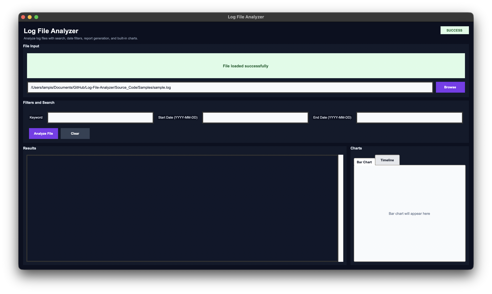
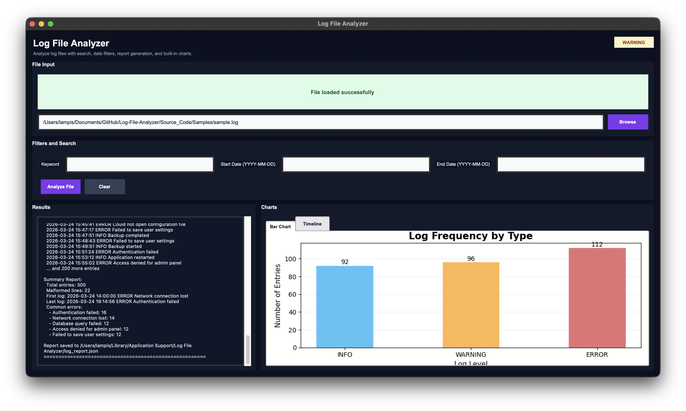
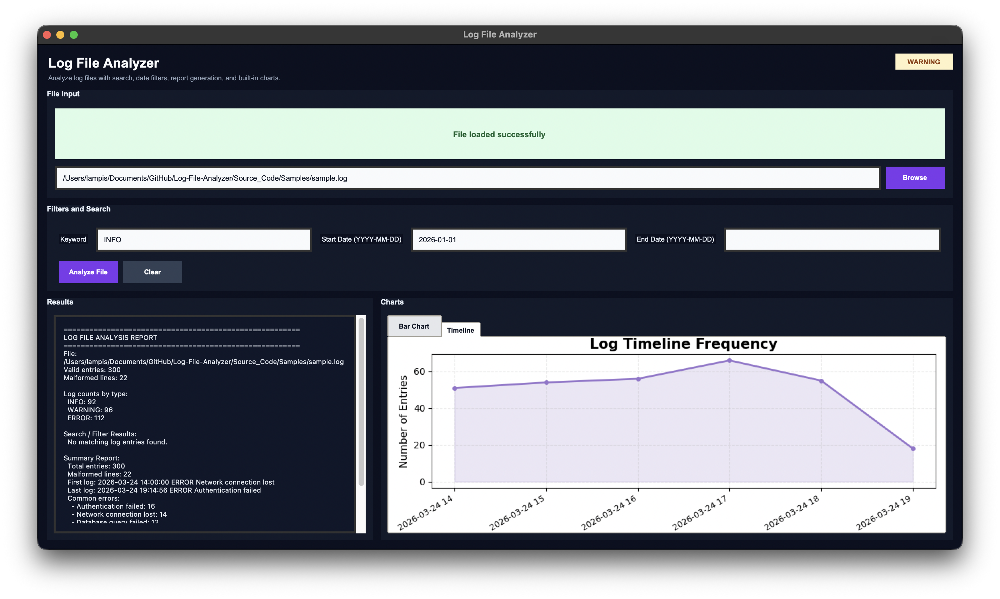

# Log File Analyzer

## Description
## Description
A Python-based Log File Analyzer that parses and analyzes `.log` files from multiple common log formats, not only generated sample logs. The application can read log entries, identify their timestamp, log level, and message content, and then produce useful summaries and visualizations for easier inspection of system or application activity.

The project supports both Command Line Interface (CLI) and Graphical User Interface (GUI) usage. Users can load a log file, search by keyword, filter entries by date range, and view analysis results in a structured and user-friendly way. The program also generates summary reports including total valid entries, malformed lines, first and last log entry, common errors, and log counts by type.

In addition, the analyzer creates visualizations such as bar charts and timeline graphs using `matplotlib`, helping users better understand log frequency and event distribution over time. Unsupported or malformed log lines are handled safely without crashing the program, making the tool robust for working with both clean and imperfect log datasets.
## Getting Started

There are two ways to run the application:

### 1) macOS app (`.app`)

- Download the provided **Log File Analyzer.zip**
- Unzip the file
- Open the generated **Log File Analyzer.app**
- Use the graphical interface to drag and drop a `.log` file or browse for one manually
- Enter optional filters such as keyword, start date, and end date
- Run the analysis directly from the GUI

> **Note:** The macOS application is intended for direct use without running Python manually. The generated reports and visualization files are stored in the application's standard data location on macOS.

---

### 2) Run from source (Python)

- Download or clone the full project folder
- Open a terminal in the project directory
- Move into the `Source_Code` folder
- Run the application from the command line

```bash
python main.py --file path/to/logfile.log
# or
python3 main.py --file path/to/logfile.log
```
> **Note:** The application also supports optional CLI arguments for search and filtering:
```python main.py --file path/to/logfile.log --keyword error --start-date 2026-03-24 --end-date 2026-03-24 ```


## User Interface Overview


The application provides a graphical user interface for analyzing `.log` files in a simple and user-friendly way. The main window is divided into clear sections so that the user can load a log file, apply optional filters, view the analysis results, and inspect the generated charts in an organized layout.

At the top of the interface, the user can load a `.log` file either through drag and drop or by using the **Browse** button. After selecting a file, the interface updates its status indicator to show whether the application is ready, successful, or encountered a warning or error.



The filter section allows the user to search log entries by keyword and optionally define a start date and end date in `YYYY-MM-DD` format. The **Analyze File** button starts the analysis, while the **Clear** button resets the fields and displayed results.



The left side of the window contains the results panel. There, the application displays the selected file path, the total number of valid entries, malformed lines, log counts by type, filtered search results, and the summary report. This gives the user a complete textual overview of the analyzed file.

The right side of the interface contains the visualization area. It uses tabs to switch between a bar chart showing the frequency of log levels (`INFO`, `WARNING`, `ERROR`) and a timeline chart showing how log activity changes over time. These charts are embedded directly inside the application window.

Overall, the GUI combines file loading, filtering, reporting, and visualization in one environment, making log analysis more practical and accessible for the user.


